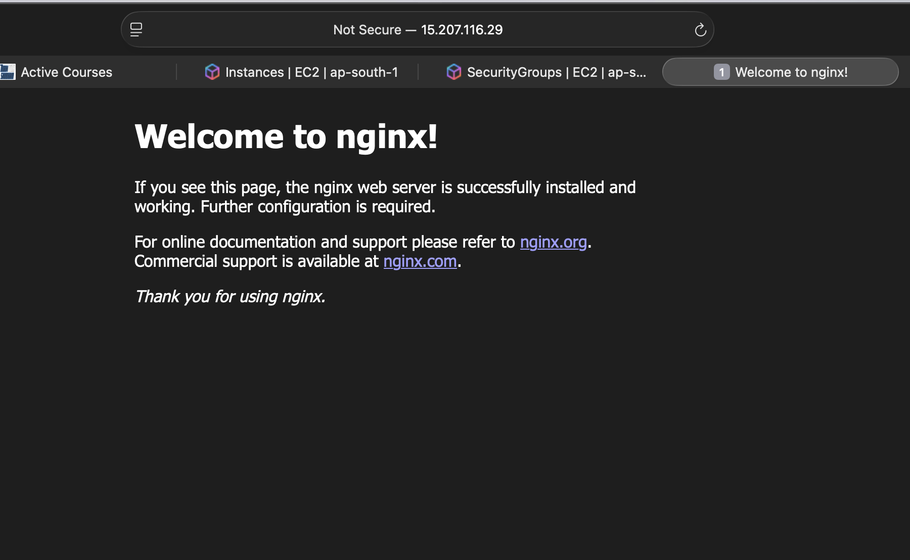

# Day 08 – Cloud Deployment

### 1. Create the Cloud Instance

- Instance name: DevOps_instance
- Provider: AWS
- Region: ap-south-1
- SSH key used: hackathon_skill_key.pem

### 2. Connect via SSH

```bash
ssh -i hackathon_skill_key.pem ubuntu@ec2-15-207-116-29.ap-south-1.compute.amazonaws.com
```

- Connection status: connected

- Observations:  
    1. I am able to connect to the ubuntu EC2 instance.
    2. It shows the usage of system when connect to the bash of instance.
    
### 3. Install Nginx

```bash
sudo apt update
sudo apt install -y nginx
```

- Installation result: installed
- Service status: service is running

### 4. Verify Web Access

- Public IP: 15.207.116.29
- Browser URL: http://15.207.116.29
- Result:


### 5. Configure Security Access

- Open port: 80
- Notes: launch wizard-2 and update the security grp to IPV4 from anywhere.

### 6. Collect Logs

```bash
sudo cat /var/log/nginx/access.log
sudo cat /var/log/nginx/error.log
```
 


## Challenges Faced

- Problem: not able to connect with ssh once enabled http, firstly i just updated the exisitng security group, i was not aware of multiple inbound rules.
- Solution: i added new inbound rule and both worked.