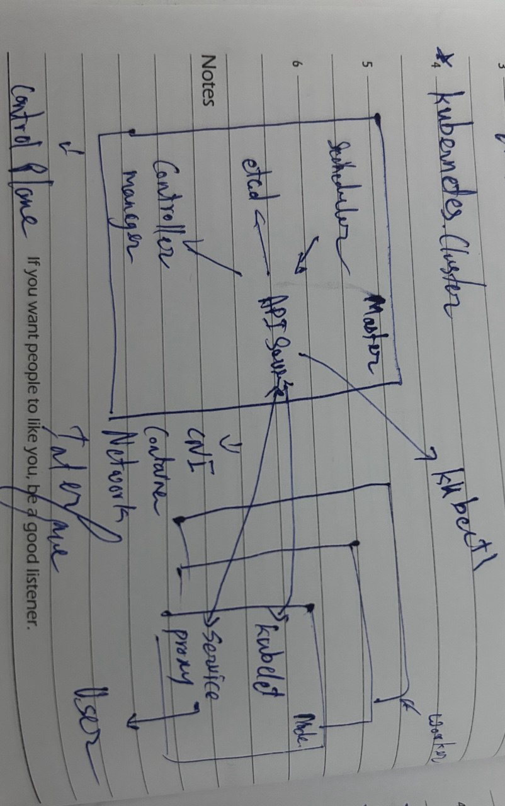
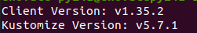
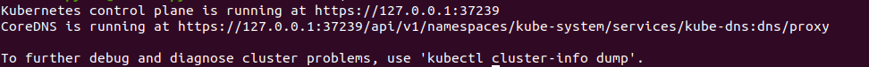
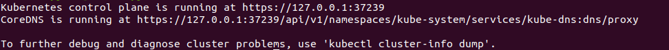
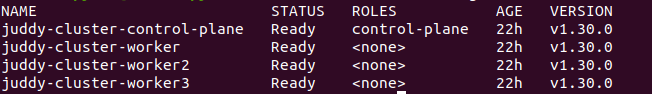
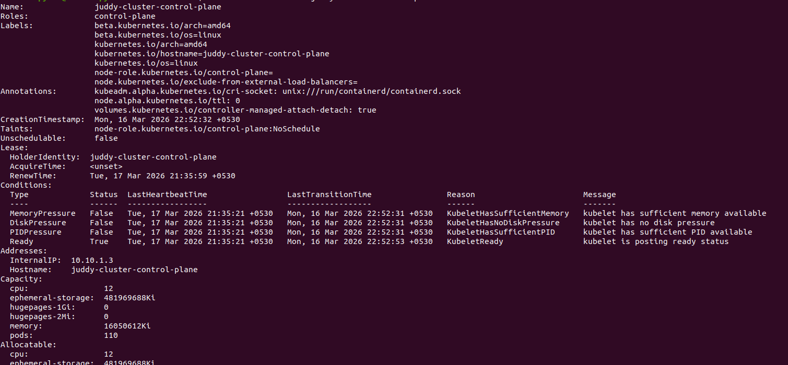
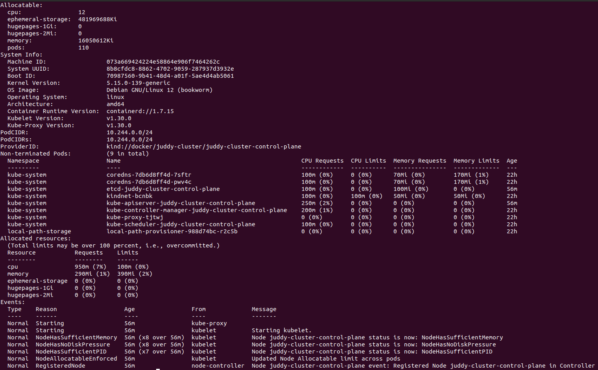
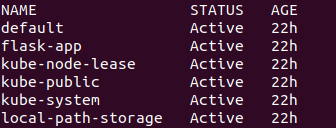
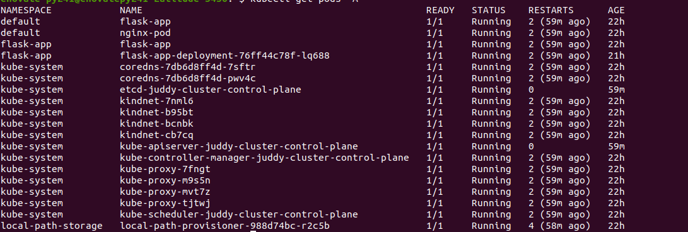
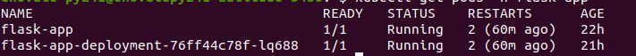

### Task 1: Kubernetes Story

1. Why was Kubernetes created? What problem does it solve that Docker alone cannot?
-   The Kubernetes created to autoscalling and auto healing. 
-   Docker alone helps create and run containers, but it does not manage them at scale. 
-   The Kubernetes solved below problems:
    -   Automatic scaling
    -   Auto healing

2. Who created Kubernetes and what was it inspired by?
-   Kubernetes was originally created by Google.
-   It was inspired by Google's internal system named Borg.

3. What does the name "Kubernetes" mean?
-   Kubernetes comes from Greek and it means helmsman or piolet.

### Task 2: Kubernetes Architecture

- What happens when you run `kubectl apply -f pod.yaml`? Trace the request through each component.
-   kubectl
        ↓
API Server (validate the YML)
        ↓
etcd (stores desired state)
        ↓
Controller Manager (Triggers creation process on the basis of state mismatch)
        ↓
Scheduler (assigns Pod to a Node)
        ↓
API Server (updates assignment)
        ↓
kubelet (on selected Worker Node)
        ↓
kube-proxy (handles networking)

- What happens if the API server goes down?
-   API Server is entry point of kubernetes, no kuberctl command will run scheduler will stop listening.
-   Existing pods keep running, kubelet continues managing containers locally

- What happens if a worker node goes down?
-   kubelet stops reporting to API Server
-   Control Plane notices node is NotReady
-   After timeout Pods on that node are marked failed
-   Controller Manager reacts: Creates replacement pods
-   Scheduler: Places new pods on healthy nodes

### Task 3: Install kubectl

### Task 4: Set Up Local Cluster
-   I am using kind for cluster creation   as for EC2 needs t3 + medium

### Task 5: Explore Your Cluster

kubectl cluster-info
-   

kubectl get nodes
-   

kubectl describe node juddy-cluster-control-plane
-   
-   

kubectl get namespaces
-   

kubectl get pods -A
-   

kubectl get pods -n flask-app
-   

### Task 6: Cluster Lifecycle
-   ****************TODO************************